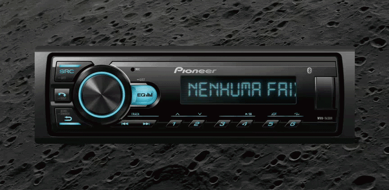

# Retro Player

Um player de áudio com tema retrô construído com Electron.



## Pré-requisitos

Certifique-se de ter o [Node.js](https://nodejs.org/) instalado.

## Instalação

Antes de rodar ou compilar o projeto, instale as dependências executando:

```bash
npm install
```

## Como executar

Para iniciar a aplicação em modo de desenvolvimento:

```bash
npm start
```

## Como gerar builds

Para gerar os executáveis de distribuição (arquivos exe/deb/dmg são gerados na pasta `/dist`):

```bash
npm run dist
```
